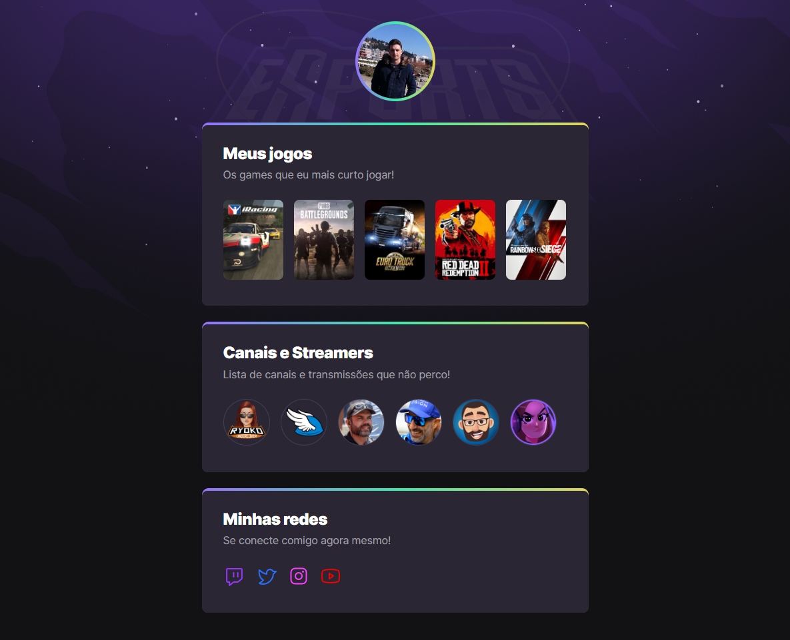

<h2 align="center">
    
</h2>

<h1 align="center">NLW eSports | Explorer - Rocketseat :rocket:</h1>

Este é o projeto realizado na trilha Explorer, do evento NLW eSports da Rocketseat.

NLW eSports - Explorer é uma página criada para adicionar e exibir os meus jogos e streamers favoritos.

A página em formato desktop é vista na imagem abaixo:

## 🛠 Tecnologias
- HTML
- CSS
- Git e GitHub

[🔗 O resultado final pode ser visto aqui](https://andreviapiana.github.io/NLW-eSports-Explorer/)